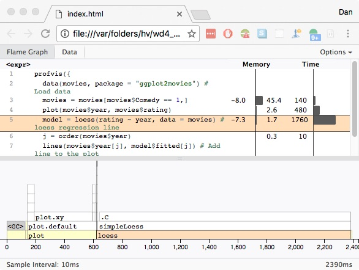

## Overview

<!--
  Prerequisites: rmarkdown, profvis, ggplot2movies
  (microbenchmark is loaded automatically if needed)

  build me with:
  R -e "rmarkdown::render('efficient_R.Rmd')"

I'm committed to discussing the following topics (this is
the official talk description):

https://www.eventbrite.com/e/brownbag-efficient-r-tickets-30505447615

Efficient R

R has a reputation as a slow language, which is somewhat undeserved. However, there are a lot of ways you can end up writing slow code if you are not careful.

We'll talk about:

* The best way to work with vectors
* Why "for" loops are slow, and what are the alternatives
* Measuring the speed of code execution
* Profiling code
* Speeding up code with compilation, caching, and parallelization

Audience: Researchers who use R, from beginners to advanced users.

The talk will be on 1/19/2017 at Noon in M4-A805/A817
-->


`R` provides many ways of doing the same things, and most of them are slow.

(This is a corollary of a quote by Robert Gentleman,
Hutch alum and co-creator of `R` (paraphrasing): "There are many efficient ways
to achieve an incorrect result.")

There are faster ways to do things, but you have to learn them.

<div class="notes">
R presentation -

as short as 15-20 mins

use the hutch way,
module load (get help from john)
'module load R' seems to work...what about RSTudio?

R / RStudio

Rprof

which is the best profiler
https://csgillespie.github.io/efficientR/
nice explanation of why for loops are bad
byte-compilation
Does microbenchmark give you more info than System.time for
trivial stuff?
caching/memoise?

factors?

</div>

## Using R the Hutch Way

* In the browser:

[http://rstudio.fhcrc.org/](http://rstudio.fhcrc.org/)

Log in with your HutchNet ID and password.

* In a terminal window:

```
ssh rhino # (provide your HutchNet password if prompted)
module load R
R
```

## Measuring speed of operations in R

`system.time()` is the function used to determine how long something takes in
`R`.

```{r}
system.time(1+1)
```

The last field, `elapsed` time, is the one we'll be most interested in here.

This operation takes *some* time, but such a small fraction that `system.time()`
doesn't display it. For finer-grained timing, we'll use the `microbenchmark`
function and package:

```{r echo=FALSE, results="hide"}
suppressWarnings({
  suppressMessages({
  if (!require("microbenchmark")) # install if necessary:
    install.packages("microbenchmark", repos="https://cloud.r-project.org")
  })
})
```

```{r}
library(microbenchmark)
microbenchmark(1+1)
```

The field to pay attention to here is the `median` field.

## Vectors

Vectors can store numbers:

```{r}
v = 1
```

...or strings (in `R` they're called "character vectors"):

```{r}
v = "Hello"
```

Vectors can store more than one item. This is done
using the `c()` function (the `c` stands for "concatenate").

```{r}
v = c(1,2,3)
v = c("Hello", "to", "you")
```

Really, vectors can store anything. But all items in a vector must be
of the same type. (Try creating a vector of numbers and strings to
see what happens.)

## Vector Operations

How do we perform an operation on every item in a vector?
In many other languages, we'd have to loop through the vector and
perform our operation on each item. In `R`, many operations
are `vectorized`, meaning they're performed on every item in the vector
at once.

```{r}
v = c(1,2,3)
v + 1 # add one to each item
sum(v) # add the whole vector together
sqrt(v) # calculate the square root of each item

```

Many functions in `R` are vectorized. Always try calling the function
directly on your vector (as in the `sqrt()` example above). If that doesn't
work, don't use a `for` loop; instead use `lapply` or one of `R`'s other
`apply` functions. More on this later.

## Creating Large Vectors

When creating large vectors, it's always best to pre-allocate the vector
(if you know the number of items you'll be putting in it), rather
than appending to the end. When appending, R will make unnecessary copies
of the vector in memory with each addition, making the operation slow
as well as memory-intensive.

```{r}
# appending (bad)
v = c() # start with an empty vector
system.time(for (i in 1:10000) v[[i]] = i)
```

```{r}
# preallocate and fill
v = integer(10000)
system.time(for (i in 1:10000) v[[i]] = i)
```

Pre-allocating is at least 10 times faster! The larger the vector,
the slower it is to append.

Actually, in this case, there's an even faster way:

```{r}
system.time({v = 1:10000}) # 1:10000 is already a vector.
```

This reinforces one of our pieces of advice, which is to avoid using
`for` loops as much as possible.


## Why are `for` loops bad?

If you've worked with other languages, you are probably used to
`for` loops, but it's a bad idea to use them in `R`.
<!-- In general, `R` is slow. Many of `R`'s core functions are written in `C`
or `FORTRAN`, fast compiled languages. The sooner you get to the underlying
`C/FORTRAN` code (and the less time spent in `R`), the faster your code will
be. --> An example: say you have a vector `x` of length `n`.

```{r}
n = 1000
x = runif(n)
```

```{r eval=FALSE}
x = x + 1
```

involves a single function call to the `+` function. Whereas the `for` loop

```{r eval=FALSE}
for (i in seq_len(n))
  x[i] = x[i] + 1
```

has

* `n` function calls to `+`;
* `n` function calls to the `[` function;
* `n` function calls to the `[<` function (used in the assignment operation)
* A function call to `for` and to the `:` operator

***


## For loops, continued

```{r}
microbenchmark(x = x + 1, for(i in seq_len(n)) x[i] = x[i] + 1)
```

## Apply functions

`for` loops are not just bad because they are slow, but because they
can make code harder to read. Consider the following snippets. Let's
create some random data (a list consisting of variable-length
vectors of random numbers):

```{r}
l <- replicate(20, runif(sample(1:10, 1)), simplify = FALSE)
```

To find the length of each vector in the list, you could write a `for`
loop:

```{r}
f <- function() {
  out <- vector("list", length(l))
  for (i in seq_along(l)) {
    out[[i]] <- length(l[[i]])
  }
  unlist(out)
}
f()
```

***

## Apply functions, continued (2)

Or you could use `lapply()`:

```{r}
unlist(lapply(l, length))
```

Once you understand that this is *applying* the function `length()` to
each element of the list `l`, the `lapply()` code is much more concise
and intuitive.

It's also faster:

```{r}
microbenchmark(f(), unlist(lapply(l, length)))
```

***

## Apply functions, continued (3)

There are a number of different apply functions for working with
different types of data:

 Function | Description
----------| ------------
`apply` | Apply functions over array margins
`by` |  apply a function to a data frame split by factors
`eapply` | apply a function over values in an environment
`lapply` | apply a function over a list or vector
`mapply` | apply a function to multiple list or vector arguments
`rapply` | recursively apply a function to a list
`tapply` | Apply a function over a ragged array

For more information on each function, see its manual page.

Remember that many functions in `R` are already vectorized,
as we saw with `sqrt()` earlier,
so you may not need to use these `apply` functions.

There are also `parallel` versions of some of these functions,
discussed next.

## Parallel Apply functions

TODO:

* start with socket clusters; mention these *could* run on
  different hosts
* find a good example
* task must be parallelizable


## Code Profiling

You've tried everything in this presentation and your code is still slow.
You can use code profiling to find bottlenecks in your code.
Here's some contrived code that looks at a dataset of movies, pulls out
the comedies, plotting the year vs. the movie rating and draws a local
polynomial regression to show the trend. It's wrapped inside a call to
`profvis()` (from the `profvis` package) which will pull up a web page
that will show us where time is spent in the code.

```{r eval=FALSE}
library("profvis")
profvis({
  data(movies, package = "ggplot2movies") # Load data
  movies = movies[movies$Comedy == 1,]
  plot(movies$year, movies$rating)
  model = loess(rating ~ year, data = movies) # loess regression line
  j = order(movies$year)
  lines(movies$year[j], model$fitted[j]) # Add line to the plot
})
```

(There is a built-in function called `Rprof()` but it's more difficult
to use and not as accurate.)

See the results on the next page.

***

## Profiling results



The actual page you get back is interactive and you can click on
individual lines to drill down deeper into the call stack.
In this case we see that most time is spent in the `loess` function
from the built-in `stats` package, and we don't have control of
that to speed it up, but at least we can see where the bottleneck is.
<div class="notes">
Be sure to have the profvis() screen already up...
</div>

## Byte compilation

The built-in `compliler` package compiles `R` code to bytecode
which *can* run much faster. Here's an inefficient `mean()` function
(don't use this for any real work, use `R`'s built-in `mean()` function).

```{r}
mean_r = function(x) {
  m = 0
  n = length(x)
  for(i in seq_len(n))
    m = m + x[i] / n
  m
}
```

Let's make a version of it that's compiled to bytecode:

```{r}
library("compiler")
cmp_mean_r = cmpfun(mean_r)
```

***

## Byte compilation, continued

Let's compare the performance of the two functions, along with
`R`'s built-in `mean()` function:

```{r}
x = rnorm(1000)
microbenchmark(times = 10, unit = "ms", # milliseconds
          mean_r(x), cmp_mean_r(x), mean(x))
```

The compiled version is quite a bit faster than our custom `R` code,
but `R`'s built-in `mean` function is much faster still, since it's
implemented in `C`.

You can byte-compile an entire package, not just a function, just add
the line

    ByteCompile: true

to the package's `DESCRIPTION` file.

## Caching

TODO: discuss memoise


## Acknowledgements

Content stolen from:

* Martin Morgan (various tutorials from the [Bioconductor](https://bioconductor.org) site).
* [The R Inferno](http://www.burns-stat.com/pages/Tutor/R_inferno.pdf), by Patrick Burns
* [Efficient R Programming](https://csgillespie.github.io/efficientR/) by Colin Gillespie and Robin Lovelace
* [Advanced `R`](http://adv-r.had.co.nz/) by Hadley Wickham


These slides are available at:

[https://github.com/FredHutch/efficient_r](https://github.com/FredHutch/efficient_r)
